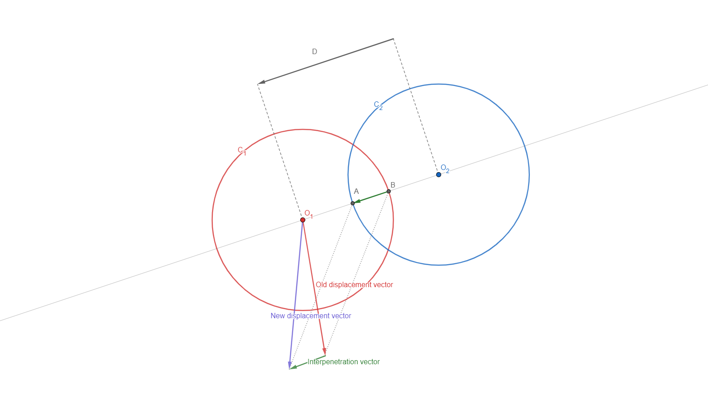

# Bouncing balls

### A small Python project to simulate circles bouncing with each other.

#### Requirements : 

*   Python 3.7 and its built-in modules
*   `pygame` for graphics and `matplotlib` for movement visualization
*   Speakers I guess?

#### Explanations

This project aims to simulate simple physics using circles that bounce with each other.

It creates N instances of a `Ball` class that store:

-   The `x` and `y` coordinates of the object's center position;
-   The `dx` and `dy` displacement vector;
-   The radius of the ball;
-   The color (for prettiness).

Each iteration of the main loop (every `1/FRAMERATE` seconds) moves each ball's according to its displacement vector.

##### In case of collision

##### …with a wall:

*   It changes `x` to its negative value for a vertical wall, `y` for a horizontal wall.

##### …with another object:

*   With $C_1$ the first ball and its center $O_1$, $C_2$ the second ball and its center $O_2$, D the distance between the centers and $A$ and $B$ the extremities of the circles on the line $(O_1, O_2)$, we can find the interpenetration vector's coordinates since we have:
    *   the length of $[AB]$ and
    *   the vector $\overrightarrow{D}$

$$
v = (\frac{D_x \times AB}{|\overrightarrow{D}|}, \frac{D_y \times AB}{|\overrightarrow{D}|})
$$

Now we have $\overrightarrow{v}$  the interpenetration vector directed from $O_2$ to $O_1$, we can just add it to $C_1$'s displacement vector to find the corrected new displacement vector.

##### $C_1$ has bounced!

As illustrated below:

We redo the process after switching $C_1$ and $C_2$ so that the other ball bounces too.

We can also simulate a mass difference between $C_1$ and $C_2$ (let's say proportional to their radius). We do not add $v$ entirely, but rather
$$
x \leftarrow x + \frac{v_x \times {r_2}}{r_1} \\
y \leftarrow y + \frac{v_y \times {r_2}}{r_1}
$$
If $r_1 \geqslant r_2$ then $v_x$ is proportionally decreased. Otherwise, $v_x$ is  increased. To counter that, we normalize the total movement of the simulation so it doesn't scale-up infinitely.

